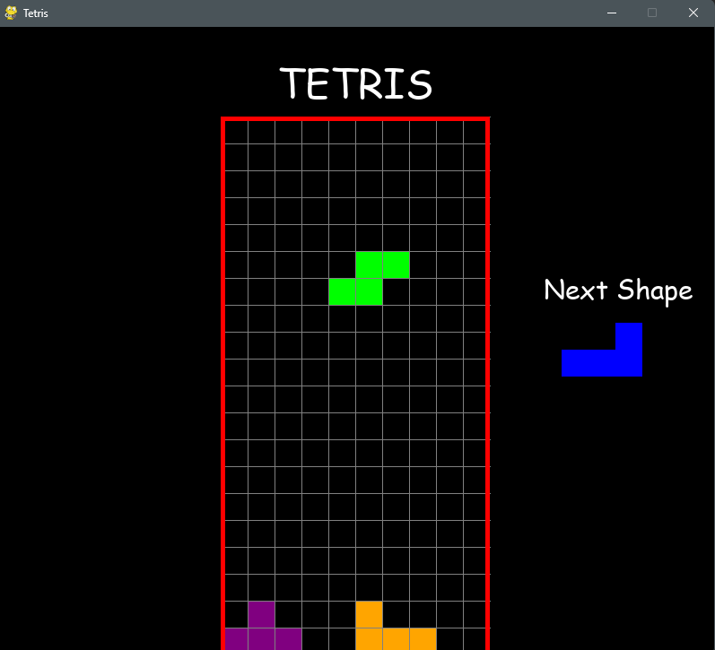

# Pyhton_TetrisGame

A simple Tetris game has been developed using Python.

Controls are operated via the keyboard arrow keys:

        - Left arrow key: Move the falling shape to the left
        - Right arrow key: Move the falling shape to the right
        - Up arrow key: Rotate the falling shape
        - Down arrow key: Accelerate the fall"

## Game UI:
